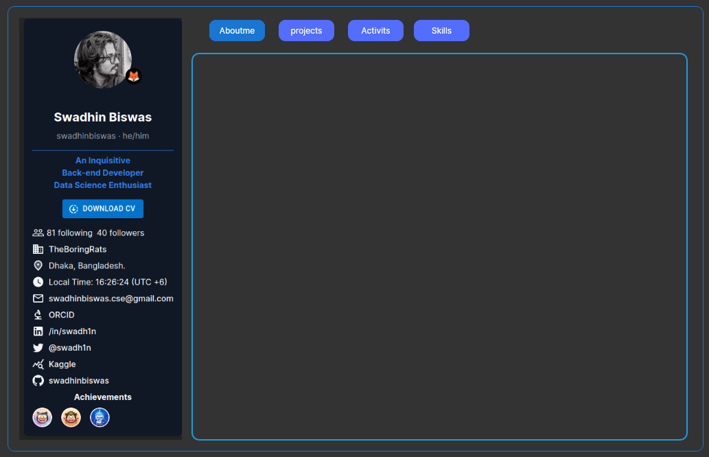

[](https://wakatime.com/badge/user/d9081c06-f3fd-422d-981c-cd2acc46a3c7/project/f2ab125e-46f1-4d3d-a3e4-167415bc1d4d)

# Portfollio (Working On It)
It's a Minimal Portfollio Template for Students,CodingEnthusiast and Dev .
- Tech Used 
   - React <br>
   - Tailwind CSS
   - Matrial UI


# Design Concept



# Run The Project

### clone and Run :
   ```
   https://github.com/swadhinbiswas/Portfolio
   ```
   ```
   cd Portfollio
   ```
   ```
   npm install 
   ```
   ``` 
   npm run dev --host
   ```

